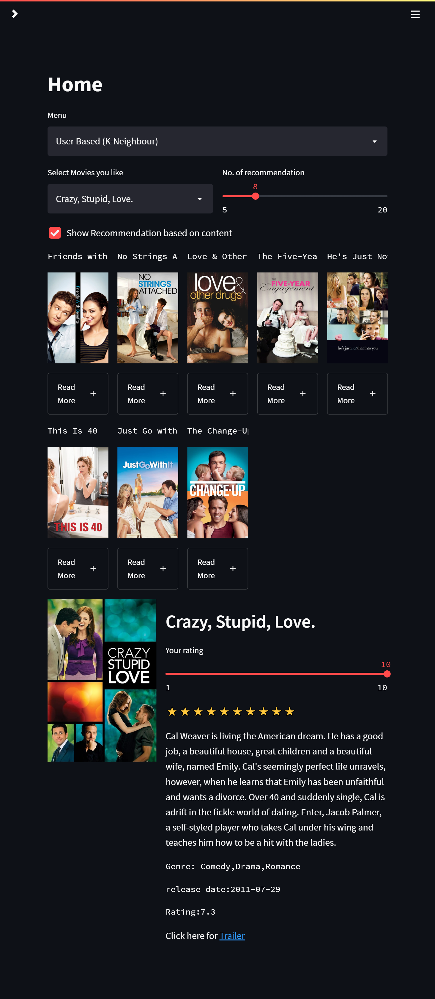

# Recommendation System
Unsupervised Learning Project

Processed Data Code : <a href="https://github.com/Baba14Yaga/ML_movie_recommendation_system">Data Preprocessing</a>
### Features in App
<ul>
  <li>Section I: Authentication</li>
  <li>Section II: Collects User rating</li>
  <li>Section III: Admin</li>
</ul>

### Three Recommendation Type:
<ul>
  <li>Section A: Content based</li>
  <li>Section B: Collaborative</li>
</ul>

## Section I: Authentication

Users need to make login IDs for them before accessing the movie recommendation app
which offers hashed passwords so that your password is safe. It also offers the functionality of registering new users .

##  Section II: Collects User rating

Users rating is collected in the database which can be later used for improving the performance of the ML recommendation system

##  Section III: ADMIN

this page is used to show the no. of registered users in the database and the ratings done by each user along with their timestamps
use username:"admin" and password:"admin" to access the admin page
<>

## Section A: Content based

In this, a user can select the number of recommendations they want related to a specific movie selected by the movie name.

code:<a href="https://github.com/Baba14Yaga/ML_movie_recommendation_system/blob/main/content_based.ipynb">Data Processing</a>

### Two Algorithm Type:
<ul>
  <li>Section A.1: Content Based (TF-IDF)</li>
  <li>Section A.2: Content Based (Bag Of Words)</li>

</ul>

### Section A.1: Content Based (TF-IDF)

This algorithm uses TfidfVectorizer for vector conversion and Cosine Similarity for calculating the angle between two vectors. On the basis of the movie name selected by the user, this algorithm retruns a list of movies sorted in descending order with respect to similarity, which is taken from the similarity matrix (which contains similarity score for each movie).

### Section A.2: Content Based (Bag Of Words)

Bag of Words uses the same technique as TF-IDF, but the score is calculated based on the frequency of the most repetitive words in the movie's content, and the similarity score is calculated in the same way as in TF-IDF.

## Section B:  Collaborative (K Nearest Neighbor)

User ratings are predicted here same as in Item-Item Collaborative filtering, but for calculating distance it uses euclidean nd manhattan distance between two vectors, and according to that, forms a similarity matrix, then shows recommendations to the user with respect to a specific movie which is selected by the user.
code:<a href="https://github.com/Baba14Yaga/ML_movie_recommendation_system/blob/main/Collaborative.ipynb">Data Processing</a>

# Installation

`pip install -r requirements.txt`

# Set Up

`streamlit run app.py`

